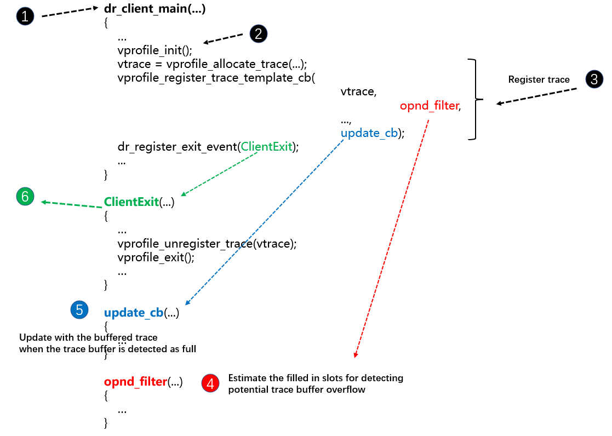

******************
Tools
******************

======================
Example use:zerospy
======================

Here we take zerospy as an example to show the use of VClinic internal tools.

^^^^^^^^^^^^^^^^^^^^^^^^^^^^^^^^^^^^^^^^^^^^^^^^^^^^^^^^^^^^^^^^^^^^^^^^^^^^^^
1. Create source file
^^^^^^^^^^^^^^^^^^^^^^^^^^^^^^^^^^^^^^^^^^^^^^^^^^^^^^^^^^^^^^^^^^^^^^^^^^^^^^

Create a simple C program and save it as a file named sample.cc.

.. literalinclude:: sample/sample.c
   :language: c
   :linenos:

^^^^^^^^^^^^^^^^^^^^^^^^^^^^^^^^^^^^^^^^^^^^^^^^^^^^^^^^^^^^^^^^^^^^^^^^^^^^^^^^^^
2. Compile your application
^^^^^^^^^^^^^^^^^^^^^^^^^^^^^^^^^^^^^^^^^^^^^^^^^^^^^^^^^^^^^^^^^^^^^^^^^^^^^^^^^^

To generate an executable binary, compile your application with GCC Compiler.

.. code-block:: console

   $ gcc -g sample.cc -o sample

.. tip::
   
   If the executable is built with ``-g`` opinion, the client will show more information, such as source code line number and source file path.

^^^^^^^^^^^^^^^^^^^^^^^^^^^^^^^^^^^^^^^^^^^^^^^^^^^^^^^^^^^^^^^^^^^^^^^^^^^^^^^^^^^^^^^^^^^^^^^^^^^
3. Run application using client
^^^^^^^^^^^^^^^^^^^^^^^^^^^^^^^^^^^^^^^^^^^^^^^^^^^^^^^^^^^^^^^^^^^^^^^^^^^^^^^^^^^^^^^^^^^^^^^^^^^

Run the generated binary ``sample`` using zerospy client.

.. code-block:: console

   $ build/bin64/drrun -t zerospy -- ./sample

The client outputs:

.. literalinclude:: sample/output.txt
   :language: cpp-objdump

.. tip::
   Intepreting the text output: The client zerospy identifys redundant zeros caused by useless computation and outputs its frequency as the metric, pc, assemble code, and full call path which reveals the locations where the redundant zeros happen in source lines and calling contexts. The full call path starts on the bottom with two dummy ``PROCESS_ROOT`` and ``THREAD_ROOT`` and ends on the top with the fuction that encloses the pc. 

======================
Build Your Own Tool
======================

We demonstrate how to create and build a VClinic client by taking a deep dive into ``vprofile_all_opnd``.

^^^^^^^^^^^^^^^^^^^^^^^^^^^^^^^^^^^^^^^^^^^^^^^^^^^^^^^^^^^^^^^^^^^^^^^^^^^^^^
Basic structure of a client
^^^^^^^^^^^^^^^^^^^^^^^^^^^^^^^^^^^^^^^^^^^^^^^^^^^^^^^^^^^^^^^^^^^^^^^^^^^^^^

This section describes the basic structure of a VClinic client.

The following code is the specific implementation of ``vprofile_all_opnd``:

.. literalinclude:: sample/vprofile_all_opnd.cpp
   :language: cpp

The diagram below shows the key functions in vprofile_all_opnd.cpp and how they relate to each other.

The easiest way to understand the client is to think of it as event driven. Each function is called upon the occurence of an event during the application execution: 

- 1. DynamoRIO loads and runs the client, calling ``dr_client_main()`` before the application execution.

- 2. In ``dr_client_main()``, the client calls ``vprofile_init()``, which initializes VClinic.

- 3. In ``dr_client_main()``, the client calls ``vprofile_allocate_trace()`` and ``vprofile_register_trace_template_cb()``, which registers trace that can collect and provide any information you want in trace buffer with custom filter(``VPROFILE_FILTER_ALL_OPND``) and callback function(``update``).

- 4. ``opnd_filter`` will Estimate the filled in slots for detecting potential trace buffer overflow.

- 5. ``update`` callback function will provide the collected information to the user for customized analysis when the trace buffer is detected as full. In fact, ``vprofile_all_opnd`` does not use the collected information but returns directly in the callback function.

- 6. The application stops running and DynamoRIO calls ClientExit(), where one can output the analysis results..

^^^^^^^^^^^^^^^^^^^^^^^^^^^^^^^^^^^^^^^^^^^^^^^^^^^^^^^^^^^^^^^^^^^^^^^^^^^^^^
Add a new client to VClinic
^^^^^^^^^^^^^^^^^^^^^^^^^^^^^^^^^^^^^^^^^^^^^^^^^^^^^^^^^^^^^^^^^^^^^^^^^^^^^^

If you want to add a new client, you need to create a folder with the client name in VClinic/src/clients, and put the client_name.cpp and CMakeLists.txt in it. Then, when you finish the programming, you can run "sh build.sh" in the VClinic root directory to build it. One can refer to any of the example clients to see how to edit the CMakeLists.txt.
